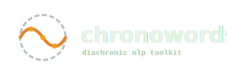

Welcome to chronowords's documentation!
=====================================

chronowords is a Python package for training small PPMI-based language models,
making topic models via non-negative matrix factorization, and detecting semantic
shift over time using the Procrustes method.

Built and maintained by `Crow Intelligence <https://crowintelligence.org/>`_.

.. toctree::
   :maxdepth: 2
   :caption: Contents:

   installation
   api
   examples

Indices and tables
==================

* :ref:`genindex`
* :ref:`modindex`
* :ref:`search`
